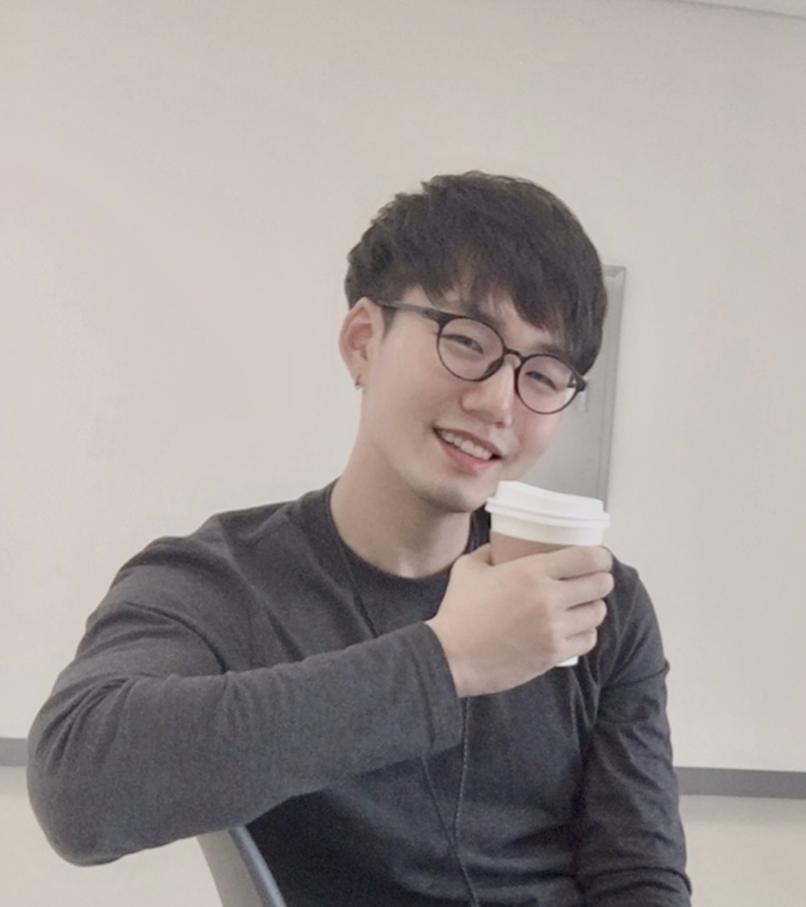

# 
  Sangkyu Son 
 
## 
 A Ph.D. student 
 

 
  Investigating on:  
  Naturalistic behavior, Monkey electrophysiology, Human EEG  
   
  Currently at:  
  Biomdeical Engineering (BME), SKKU, Republic of Korea  
  Center for Neuroscience Imaging Research (CNIR), IBS, Republic of Korea   

